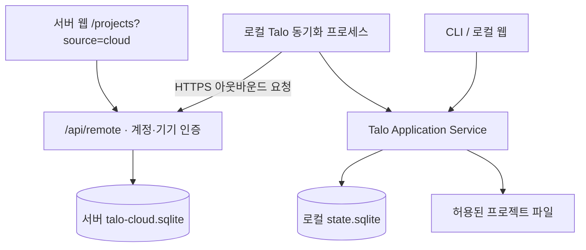

# Talo / Think Along — 로컬·서버 저장·원격 실행 설계 v0.3

작성: 2026-09-05. 이 문서는 v0.2의 “로컬 SQLite만 유일한 원본” 경계를 서버 동기화 모드에 한해 대체한다. 로컬 전용 모드는 유지한다. 웹 소스는 think-along_start, 실행 코어는 Talo/cli에 둔다.

## 제품 경험

| 구분 | 로컬 웹 | think-along.ai.kr 서버 연결 |
|---|---|---|
| 접속 | 같은 컴퓨터의 브라우저 | 계정 로그인 후 연결한 프로젝트·기기 선택 |
| 기록 | 로컬 SQLite | 서버에 보존한 기록 + 연결된 기기의 동기화 |
| 실행 | 로컬 코어 | 온라인 기기에 요청 전달, 같은 코어가 실행 |
| 조건 | 로컬 웹과 Talo 코어 실행 가능 | 인터넷·페어링·동기화 프로세스·명시적 실행 허용 |
| 기기 오프라인 | 로컬에서 사용 | 저장 기록 열람·결정 편집 가능, 실행 불가 |
| 동시 사용 | CLI와 같은 프로젝트 | 동일 요청 ID 중복 방지, 프로젝트 실행 직렬화 |

웹의 데이터 연결과 실행 기기의 온라인 여부를 따로 표시한다. 서버에 저장된 기록은 기기 연결이 없어도 조회할 수 있다. 오프라인 명령은 자동 대기열에 넣지 않는다. 다시 연결된 기기에서 사용자가 새로 요청한다.

## 토폴로지



이번 구현은 Next.js 표준 HTTP 라우트와 3초 폴링을 사용한다. WSS는 필수 의존성이 아니다. 외부에서 로컬 포트에 접속하지 않으므로 공유기 포트 개방이 필요 없다. 서버는 상시 Node 22.13+ 프로세스와 영속 디스크가 필요하다. 다중 서버·수평 확장은 PostgreSQL 등 별도 저장소 이전 후 지원한다.

## 소유권과 저장 정책

- 대화·Run·결정·검증은 원래 ID로 서버에 병합 보존한다. 최초 동기화는 전체 기록을 약 1MB 묶음으로 나눠 전송하며, 이후 데이터 revision이 같으면 heartbeat만 보낸다. 단일 기록이 500KB를 초과하면 조용히 버리지 않고 명시적 동기화 오류로 중단한다. 제한된 로컬 snapshot이 올라와도 이전 서버 기록을 지우지 않는다.
- 서버에서 확정한 결정은 revision을 기준으로 CAS 수정하고, 대체된 결정을 보존한다. 동기화 프로세스는 이를 로컬 memory에 cloud_ ID로 반영한다.
- 로컬에서 같은 결정을 수정하면 자동 덮어쓰기를 거부하고 충돌을 표시한다. 동기화가 미완료거나 충돌 상태이면 새 원격 실행을 차단한다.
- 서버는 작업 기록의 보존과 웹 편집 기준이다. 실제 코드·브랜치·파일 hash와 변경 적용 여부는 로컬 기기가 최종 판단한다.
- 동기화는 프로젝트별 --sync-records 명시 후 시작한다. 기록에는 사용자가 입력한 대화 내용이 포함되므로 민감한 본문을 공유할지는 사용자 책임 있는 선택으로 안내한다.
- API 인증 설정과 원시 Run 객체, 파일 before/after 내용은 화이트리스트로 제외한다. 문자열 자격증명 패턴도 정제한다. 임의 자연어의 모든 비밀정보를 탐지한다고 보장하지 않는다.
- diff 전송·결과 저장은 --share-diff로 별도 허용한다. 소스 저장소 전체 업로드는 하지 않는다.
- 연결 해제는 새 명령과 동기화를 차단한다. 서버 사본 삭제는 연결 해제 뒤 별도 명시 행동이다. 로컬 파일·SQLite를 삭제하지 않는다.

## 인증과 페어링

기존 이메일 입력만으로 발급하던 개발용 로그인은 원격 실행 권한으로 인정하지 않는다. 원격 계정은 scrypt 비밀번호 해시·무작위 HttpOnly SameSite=Strict 세션을 사용하며 HTTPS에서 Secure 쿠키를 설정한다. 이메일 검증·비밀번호 재설정·기존 계정 통합은 아직 제공하지 않는다.

기기는 5분 유효 일회용 코드와 256비트 claim secret을 생성받는다. 로그인 사용자가 코드를 승인하고, claim secret을 가진 로컬 기기만 한 번 기기 토큰을 수령한다. 서버는 토큰 해시만 저장한다. 로컬 자격증명 파일은 0600이며 토큰을 URL·로그에 싣지 않는다. 기기 연결 해제 시 서버에서 즉시 토큰 사용을 거부한다.

Host와 Origin은 TALO_CLOUD_ORIGIN 하나로 제한한다. 공개 운영은 HTTPS 필수이며 http는 localhost 테스트만 허용한다. 인증 없는 device 헤더는 pair.start/claim만 허용한다. 소유권은 모든 프로젝트·명령·기기 조회에서 다시 검사한다.

## 원격 실행 계약

1. 웹이 projectId, requestId, method, params, notesRevision을 보낸다.
2. 서버는 소유권·기기 온라인·실행 허용·결정 동기화 완료를 검사한다.
3. 요청은 15초 만료 queued 상태로 저장한다. 전달 시 delivered로 원자적으로 전이하며 자동 재배정하지 않는다.
4. 로컬은 프로젝트 ID·만료·실행 허용을 재검사한다. 브라우저가 임의 경로나 shell 명령 실행 권한을 정할 수 없다.
5. run은 plan/read_only 또는 dev/project_edit로 기존 실행 서비스를 호출한다. 파일 변경은 기존 변경 제안·hash 검토·적용·undo 엔진을 사용한다.
6. 로컬 실행 원장과 서버 원장이 ID 기준 중복을 방지한다. 결과 업로드 실패는 결과만 재전송한다.
7. 기기 중단 시 started 원장은 미확정 오류로 보고하며 명령을 자동 재실행하지 않는다. 실제 로컬 Run·파일 상태를 확인해야 한다.
8. 계정 연결 해제는 이미 실행 중인 프로세스를 강제 종료하지 않는다. 이 상태를 웹에 안내한다.

method: run, diff, apply, undo, cancel, recover. 현재 임의 대화형 PTY/셸, 원격 관리자 권한, 무승인 배포는 제공하지 않는다. 완료 결과와 주기적 실행 상태를 전달하며 토큰 단위 스트리밍은 후속이다.

## 실행 방법

서버:

```bash
npm ci --include=optional
TALO_CLOUD_ENABLED=1 TALO_CLOUD_ORIGIN=https://think-along.ai.kr npm run build
TALO_CLOUD_ENABLED=1 TALO_CLOUD_ORIGIN=https://think-along.ai.kr TALO_CLOUD_DB=/var/lib/think-along/talo-cloud.sqlite npm start
```

프로세스 사용자만 DB 디렉터리에 접근하도록 하고, reverse proxy HTTPS 뒤에 배치한다. /api/remote를 다른 서버로 덮어쓰는 API_PROXY_ORIGIN 설정을 제거한다. DB와 WAL을 포함하는 안전한 백업 정책이 필요하다.

로컬 프로젝트 폴더:

```bash
talo remote pair --sync-records --allow-run --share-diff
# 웹에서 코드 승인 후
talo remote start
# macOS 로그인 시 백그라운드 실행을 원하면
talo remote install
# 상태 / 자동 시작 해제 / 연결 해제
talo remote status
talo remote uninstall
talo remote disconnect
```

서버 URL은 --server로 변경할 수 있다. 로컬 개발 검증은 http://127.0.0.1:3002와 명시적인 TALO_CLOUD_ORIGIN을 사용한다. 로컬 전용 웹은 기존 npm run web:local로 제공한다. 단일 바이너리·Homebrew 공개 배포와 서버 운영 배포는 이 기능의 코드 구현과 별개다.

## 검증 기준

계정 간 접근 차단, 기존 개발 세션 차단, 일회용 페어링, DB 재시작 후 기록 보존, 오프라인 결정 편집, CAS 충돌, 실행 중복 방지, 응답 유실 후 결과 재전송, 연결 폐기, 코드 공유 opt-in, 실제 임시 파일 apply/undo, CLI 전체 회귀, 웹 lint/typecheck/test/build를 확인한다. 실제 사용자 계정·실프로젝트를 테스트용 서버에 업로드하지 않는다.

## 개발 환경에서 바로 확인

웹 폴더에서 `npm run web:cloud`를 실행하면 서버 모드를 `http://127.0.0.1:3003/projects?source=cloud`에서 확인할 수 있다. 운영 도메인 배포와 별개인 로컬 서버 검증 모드다. 화면에 나타나는 `--server` 주소를 사용해 테스트 기기를 연결한다. 이때 사용자가 실제 프로젝트 동기화를 선택하면 해당 테스트 서버 DB에 기록이 저장된다.

## 이번 구현의 경계

- 자체 계정·단일 서버·프로젝트별 연결 기기 1개를 기준으로 구현했다. 서로 다른 기기의 같은 Git 저장소를 하나의 프로젝트로 자동 병합하지 않는다.
- 서버에 저장된 대화 기록을 읽고, 결정을 편집하고, 온라인 로컬 기기로 실행을 요청할 수 있다. 기기 없이 서버 자체에서 AI를 실행하는 기능은 이 경로에 포함하지 않는다.
- API 키·비밀번호·OTP 자동 수집이나 브라우저 인증정보 추출은 없다. 기기 토큰은 프로젝트별 로컬 권한 파일에 저장한다.
- 서버 DB는 SQLite 트랜잭션 안의 JSON 상태로 보존한다. 현재 소규모 단일 인스턴스용이며 대규모 운영에는 테이블 정규화·PostgreSQL·레코드별 증분 프로토콜로 확장해야 한다.
- 기기 인증이 폐기되면 로컬 토큰을 제거하고 동기화 프로세스가 정상 종료한다. macOS 서비스는 의도적인 정상 종료를 자동 재시작하지 않는다.
- 서버 저장 암호화는 운영 디스크 암호화 정책이 필요하다. 현재 클라이언트 간 종단간 암호화를 구현했다고 주장하지 않는다.
- TLS 인증서·운영 환경변수·백업·기존 계정 통합은 실제 서버 배포에서 확인해야 한다. 이 작업은 운영 도메인을 자동 배포하지 않는다.

## 검증 결과 (2026-09-06)

- `TALO_REMOTE_E2E=1 npm run verify`: 웹 lint·TypeScript·테스트 28개·프로덕션 빌드 통과.
- Talo CLI 전체 `pytest`: 114개 통과. 기존 로컬 웹 브리지 테스트 4개도 통과.
- 실제 HTTP 페어링 → 임시 프로젝트 daemon 동기화 → 서버 결정 로컬 반영 → diff → 파일 apply → undo → 기기 연결 해제 → 오프라인 기록 열람·결정 편집을 통합 검증했다. 실사용 프로젝트나 실제 AI 계정을 테스트 서버에 업로드하지 않았다.
- 브라우저는 별도 UI 검증 예제 계정으로 오프라인 실행 버튼 차단과 서버 결정 저장을 직접 확인했다. 운영 도메인에 로그인하거나 사용자 계정을 생성한 검증은 아니다.
- macOS 자동 시작 등록은 launchctl 호출을 대체한 테스트로 plist·작업 폴더·토큰 미포함을 확인했다. 사용자 로그인 항목에 테스트 서비스를 실제 등록하지 않았다.
- 빌드는 성공하지만 기존 로컬 브리지의 Turbopack 파일 추적 경고 1건과 Node SQLite experimental 경고가 남아 있다. 배포 범위 검토 시 별도 확인한다.
- 운영 `think-along.ai.kr` 배포와 기존 운영 계정 이전은 수행하지 않았다. 서버 모드 개발 실행은 `npm run web:cloud`로 확인한다.
