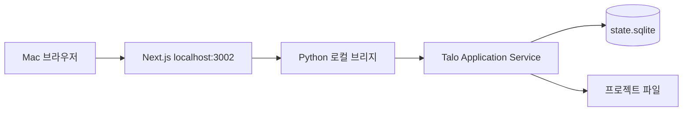
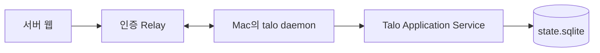

# Think Along 웹 — Talo 연속 작업 경험 기획·UI 설계 v0.2

작성일: 2026-09-05 · 상태: 로컬 웹 v0.2 구현 완료 · 원격 연결 설계 포함

## 1. 제품 정의와 이번 결정

**지난 작업을 다시 설명하지 않고, 확인한 상태에서 이어가는 프로젝트 작업 공간.**

첫 대상은 AI 코딩 도구로 여러 날에 걸쳐 프로젝트를 진행하는 개인 개발자다. 웹은 현재 상태·변경 검토·결정 확인을 담당하고, 실행과 파일 변경은 Talo 코어가 담당한다. 여러 사람이 각자 쉽게 사용하는 경험부터 검증한다. 팀 공동 편집·역할별 권한·휴대폰 원격 실행은 후속 범위다.

- 웹 개발 기준: `/Users/choisunghoon/Documents/Aitime/think-along_start`
- CLI 코어: `/Users/choisunghoon/Documents/Aitime/Talo/cli`
- 읽기 전용 원본: `/Users/choisunghoon/Documents/Aitime/think-along`
- 웹 폴더를 Talo로 이전한다는 기존 기술 설계 4.4절 제안은 이번 사용자 지정으로 대체한다. 개발 소스는 현재 웹 폴더에서 유지하고, 향후 빌드 산출물만 CLI 패키지에 포함할 수 있다.
- 기존 Think Along의 일반 대화와 API 중심 경험을 즉시 삭제하지 않는다. 새 프로젝트 화면부터 별도 진입 경로로 추가한 뒤 검증한다.
- 화면 브랜드는 당분간 Think Along, 연결 엔진 표기는 Talo로 유지한다. 별도 제품 두 개를 설정하라고 요구하지 않는다. 최종 브랜드 통일은 별도 결정이다.

성공의 기준은 모델 연결 개수가 아니라 재개할 때 반복 설명과 확인에 드는 시간이 줄어드는 것이다. 아래 UI 예시는 모두 설계용 예시이며 실사용 성과가 아니다.

## 2. 확인한 현재 구조와 재사용

코드·문서 기반 조사이며 기존 화면을 브라우저에서 직접 조작한 사용성 감사는 아니다.

| 근거 | 확인 내용 | 설계 반영 |
| --- | --- | --- |
| `app/page.tsx` | home/thinking/timeline/insight/account/dashboard 등의 화면 상태 | 프로젝트 중심 라우트를 분리하고 대화는 프로젝트 내부에 배치 |
| `components/dashboard/AutomationDashboard.tsx` | 별도 대시보드 컴포넌트 | 정보 배치 참고. 자동화 데이터와 실행 로직은 그대로 이식하지 않음 |
| `lib/server/db.ts` | `data/db.json` 기반 저장, 예제 자동화 초기 데이터 | 새 프로젝트 화면은 코어 조회 계약 사용. 예제 성과를 실제 활동으로 표시하지 않음 |
| `app/globals.css` | 짙은 남색 배경, 청록 강조, Geist 글꼴, 테마 변수 | 기존 토큰 계열 유지, 장식보다 읽기와 상태 구분 개선 |
| `docs/PROJECT_CONTEXT.md` | 세션·기억 소유, 수동 모델 전환, 결정 변경 이력 | 공급자와 무관한 작업 정체성 유지 |
| `docs/ARCHITECTURE.md` | 기존 Thinking과 세션 호환, 점진적 분리 | 기존 세션 식별자를 임의 재생성하지 않음 |
| Talo 기술 설계 v0.2 / CLI 구현 안내 | SQLite 변경 제안·undo·stdio 코어, HTTP/SSE는 후속 | 이미 가능한 기능과 새 브리지 요구를 구분 |

## 3. 핵심 사용자 흐름

### 처음 방문

첫 문구는 “진행 중인 프로젝트를 이어가세요.” 주 행동은 **프로젝트 연결**, 보조 행동은 **예제로 둘러보기**다. 닉네임·관심사·전체 모델 선택을 선행 필수 단계로 두지 않는다.

로컬 코어가 연결되면 등록된 프로젝트와 폴더 경로를 보여준다. 일반 브라우저의 파일 선택만으로 로컬 절대 경로와 실행 권한이 확보됐다고 간주하지 않는다. 새 폴더 등록은 코어가 제공하는 선택 흐름 또는 CLI 등록으로 처리한다. 실제 응답 확인 전에는 AI 연결을 “확인 전”으로 표시한다.

예제는 읽기 전용 데이터로 분리한다. “예제 프로젝트 · 실제 파일은 변경되지 않습니다”를 상단에 계속 표시한다. 예제 승인·undo는 예제 내부에서만 동작하며 실프로젝트로 섞이지 않는다.

### 다음 날 재개

프로젝트 열기 → 마지막 작업·남은 일·검증 상태 확인 → **이어서 작업** → 같은 세션의 실행 화면. 버튼은 기록이 있는 세션을 명시적으로 선택한다. 새 요청은 마지막 목표를 자동 재실행하지 않고 사용자가 편집 가능한 초안으로 제시한다.

### CLI 작업을 웹에서 검토

CLI가 변경을 제안 → 웹 검토함에 해당 변경 묶음 도착 → diff·검증·영향 확인 → 적용 → 코어 결과 확인 → 타임라인에 적용 기록. 웹과 CLI가 동시에 승인해도 변경은 한 번만 적용한다.

### AI 변경

프로젝트 안에서 모델 선택 → 전달할 목표·결정·최근 대화·미완료 작업 확인 → 다음 요청부터 반영. 진행 중 Run의 모델은 바꾸지 않는다. 실패한 요청은 초안을 보존하며 다른 모델로 자동 재전송하지 않는다.

## 4. 정보 구조와 경로

| 범위 | 메뉴 / 제안 경로 | 목적 |
| --- | --- | --- |
| 전체 | 프로젝트 `/projects` | 최근 프로젝트를 찾아 재개 |
| 전체 | 검토함 `/reviews` | 내 프로젝트의 검토 대기 항목. 프로젝트 이름을 항상 표시 |
| 프로젝트 | 개요 `/projects/:id` | 마지막 작업·남은 일·검증·다음 행동 |
| 프로젝트 | 작업 `/projects/:id/sessions/:sessionId` | 세션 대화와 실제 실행 상태 |
| 프로젝트 | 변경 `/projects/:id/changes/:changeId` | 묶음 단위 diff 검토·적용·복구 |
| 프로젝트 | 결정 `/projects/:id/decisions` | 확정·제안·대체된 결정과 출처 |
| 프로젝트 | 기록 `/projects/:id/history` | 시간순 실행·검증·결정·모델 변경 |
| 전체 | 설정 `/settings/connections` | 연결·모델·고급 설정 |

대시보드·인사이트·스킬·자동화를 같은 깊이의 주 메뉴로 나열하지 않는다. 검색은 처음에는 현재 프로젝트 내부 검색으로 한정한다. 검토함의 개수는 실제 대기 항목만 센다.

## 5. UI 배치 명세

기준 화면 1440×1024. 전체 앱은 페이지를 채우며 거대한 외곽 카드로 감싸지 않는다. 왼쪽 탐색 224px, 상단 컨텍스트 바 64px, 본문 여백 32px. 본문은 최대 1120px이며 긴 설명의 읽기 폭은 680~760px이다. 본문 제목·구분선·여백으로 계층을 만들고 모든 항목을 카드로 만들지 않는다.

### A. 프로젝트 목록

| 영역 | 내용 / 배치 | 행동 |
| --- | --- | --- |
| 제목 행 | “프로젝트”와 짧은 설명, 오른쪽 프로젝트 연결 | 연결 흐름 진입 |
| 최근 작업 | 프로젝트명, 한 줄 목표, 남은 일, 마지막 활동 시각, 기기 연결 상태를 행으로 표시 | 행 클릭은 개요. 별도 이어하기 버튼 |
| 검토 알림 | 대기 검토가 있을 때만 “검토할 변경 2건” | 해당 프로젝트 검토함 |
| 빈 상태 | “아직 연결한 프로젝트가 없습니다” | 연결 / 예제 |

임의 성공률·절약 토큰·AI 생산성 점수를 표시하지 않는다. 프로젝트 정렬은 최근 활동 기본이며 사용자가 고정할 수 있다.

### B. 프로젝트 개요 — 권장 기본 화면

상단에 프로젝트명·브랜치·연결 상태를 표시한다. 본문 첫 줄은 “연결 오류 복구를 이어갈까요?”처럼 기록으로 확인 가능한 목표다. 기록이 없으면 “첫 작업을 시작하세요.”로 대체한다.

| 위치 | 컴포넌트 | 필수 내용 |
| --- | --- | --- |
| 본문 상단, 가장 큰 영역 | 이어하기 요약 | 마지막 목표, 마지막 세션, 남은 일 최대 3개, **이어서 작업** |
| 요약 아래 | 검증 요약 | 통과/실패/미확인/현재 변경 이후 미검증, 실행 시각과 근거 링크 |
| 오른쪽 300px 보조 영역 | 주의가 필요한 일 | 승인 대기 또는 복구 필요가 있을 때만 노출 |
| 본문 하단 | 최근 기록 | 최근 5건. “기록 전체 보기” |

“완료”는 모델이 답변을 끝낸 것과 작업 목표를 달성한 것을 구분한다. 모델 응답 종료는 “응답 완료”, 사용자가 근거와 함께 확인한 목표만 “완료 확인됨”이다.

### C. 작업 화면

중앙은 세션 대화, 오른쪽은 접을 수 있는 작업 맥락 패널이다. 패널에는 목표·확정 결정·남은 일·전달 범위만 둔다. 하단 요청 입력창은 초안을 유지한다.

상단은 **현재 방식: 계획 / 개발**, 권한, 다음 요청에 사용할 모델을 표시한다. 과거 Run은 각 기록 안에 **실행 당시 방식**을 표시한다. CLI의 `/plan`·`/status`에서 발생한 혼동이 웹에서도 반복되지 않게 한다.

진행 중 작업에는 “실행 중”, 중단 요청 이후에는 “중단 요청됨”, 코어가 종료를 확인한 뒤 “중단됨”으로 표시한다. 실행 중 새로운 요청은 첫 범위에서 대기열에 자동 투입하지 않고 초안으로 유지한다.

### D. 변경 검토 화면

파일 목록 240px / diff 가변 폭 / 검증·행동 영역 280px. 좁은 화면에서는 검증 영역을 상단 요약과 하단 행동 바로 합친다.

- 헤더: 프로젝트·브랜치·변경 묶음 제목·제안 시각·제안한 모델.
- diff: 추가/삭제 줄 번호, 텍스트 기호와 색을 함께 사용. 줄바꿈·공백 변화는 펼쳐 확인.
- 근거: 정확 일치 또는 문맥 기반 후보, 실제 수행된 검증, 미수행 항목.
- 주 행동: **이 변경 적용**. 보조 행동: **수정 요청**, **취소**.
- 적용은 전체 묶음 단위다. 현재 코어가 지원하지 않는 줄별 승인·일부 파일 승인 UI는 제공하지 않는다.
- 수정 요청은 기존 승인을 재사용하지 않고 새 제안을 생성한다. 이전 제안과 연결하고 새 diff를 다시 검토한다.
- 승인 중에는 버튼 중복 클릭을 막지만 성공 여부는 코어 응답으로 확정한다. 응답 유실은 “결과 확인 중”이며 무조건 재실행하지 않는다.
- 파일이 바뀌었으면 “검토 이후 파일이 변경됐습니다. 최신 변경을 다시 확인하세요.”로 전환한다.

적용 후 **되돌리기**는 같은 변경 묶음을 보여주고 코어가 허용할 때만 활성화한다. 사용자가 이후 파일을 수정했으면 “이후 수정과 충돌하여 자동 복원할 수 없습니다”를 표시한다. 중단된 적용 복구와 정상 적용 undo는 서로 다른 행동으로 구분한다.

### E. 결정 화면

목록 행에는 결정문·상태·시각·출처를 표시한다. 선택 시 상세 패널에 이유·관련 작업·이전 결정·원문 링크를 연다. 상태 필터는 확정 / 제안 / 이전 결정이다.

수정은 새 버전을 만들고 기존 결정을 “대체됨”으로 남긴다. AI 제안은 사용자 확정 전까지 확정 결정으로 전달하지 않는다. 상충 결정이 있으면 둘을 함께 보여주고 선택을 받는다. 기존 웹 상태값과 CLI 기억 상태는 어댑터에서 매핑한다.

### F. 기록 화면

날짜별로 실행·변경 제안·적용·undo·검증·결정 변경·모델 전환을 시간순 표시한다. 이벤트를 눌러 당시 세션·diff·검증 근거로 이동한다. 기본은 사용자 행동 단위로 묶고 원시 도구 로그는 상세 안에서 연다.

### G. 연결 화면

코어 연결과 AI 응답 확인을 별도 항목으로 표현한다. “Talo 연결됨”이 “AI 응답 정상”을 뜻하지 않는다. 주 화면에는 실제 사용 가능한 연결을 우선 표시하며 API 주소·모델 ID·MCP 설정은 고급 항목에 둔다. 실제 호출 전에는 비용 발생 가능 여부와 호출 목적을 연결 확인 행동에 표시한다.

## 6. 시각 체계와 반응형

| 항목 | 설계 기준 |
| --- | --- |
| 색상 | 기존 배경 `#0b121c`, 보조 `#111a2a`, 본문 `#f7f9fc`, 강조 `#12b996` 계열 유지 |
| 의미 색 | 청록=주 행동, 황색=대기/주의, 적색=실패, 청색=진행. 글자 라벨 병기 |
| 글꼴 | 기존 Geist·시스템 한글 폴백, 코드만 고정폭. 본문 15~16px, 보조 14px, 제목 24~28px |
| 간격 | 4/8/12/16/24/32px, 섹션 간격 32px. 모서리 8px, 그림자 최소 |
| 데스크톱 ≥1200px | 탐색+본문+필요한 보조 패널 |
| 태블릿 768~1199px | 탐색 접기, 보조 패널 drawer, diff 기본 unified |
| 모바일 <768px | 단일 열, 프로젝트·검토함·설정 탐색. 코드 영역만 가로 스크롤 |
| 접근성 목표 | 일반 텍스트 대비 4.5:1, 큰 글자 3:1, 터치 대상 44px, 명시적 키보드 focus |

색 대비는 구현 시 실제 조합으로 측정한다. 기존 보조 글자 토큰을 작은 본문에 무조건 재사용하지 않는다. 패널을 닫으면 초점을 호출 버튼으로 돌리고, 실행 상태는 방해하지 않는 live region으로 알린다. 자동 스크롤은 사용자가 과거 기록을 읽는 동안 멈춘다.

## 7. 필수 상태와 문구

| 상태 | 사용자에게 보이는 내용 | 허용 행동 |
| --- | --- | --- |
| 연결 중 | “Talo에 연결하고 있습니다” | 취소 |
| 코어 미연결 | “이 기기의 Talo 연결이 필요합니다” | 연결 안내 / 예제 |
| 데이터 없음 | “아직 작업 기록이 없습니다” | 첫 요청 |
| 연결 끊김 | “연결 끊김 · 마지막 확인 14:32” | 기록 읽기 / 재연결, 쓰기 비활성 |
| 검증 미확인 | “검증 기록이 없습니다” | 근거 확인 또는 후속 검증 요청 |
| 오래된 검증 | “현재 변경 이후에는 검증하지 않았습니다” | 최신 검증 요청 |
| 승인 대기 | “적용 전 확인이 필요합니다” | diff 검토 |
| 중복 승인 | “다른 화면에서 이미 적용했습니다” | 현재 결과 조회 |
| 충돌 | “검토 이후 파일이 변경됐습니다” | 새 diff 조회 |
| 부분 적용 중단 | “복구가 필요한 변경이 있습니다” | 복구 상세, 일반 적용 중지 |
| AI 호출 실패 | 오류 원인과 저장된 초안 | 사용자 선택으로 재시도·모델 변경 |

온라인으로 보이는 동안에도 snapshot 시각·revision을 유지한다. 오프라인 승인을 큐에 넣어 재접속 시 자동 적용하지 않는다.

## 8. 코어 연결과 데이터 계약

목표는 **브라우저 → 로컬 인증 API → Talo Application Service → SQLite**다. 브라우저는 SQLite를 직접 읽지 않는다. Next.js 서버가 별도 프로젝트 상태를 JSON에 쓰거나 모델 실행을 중복 수행하지 않는다.

현재 `talo serve`는 stdio JSONL 인터페이스다. HTTP·SSE·`talo web` 실행은 아직 구현된 기능으로 안내하지 않는다. 웹을 실제 연결하려면 로컬 API 브리지와 읽기 모델을 먼저 구현해야 한다. 기존 Next.js API의 UI 의존을 분리한 뒤 정적 배포 가능 여부를 검증한다.

| 화면 데이터 | 최소 조회 계약(제안) | 현재 준비 상태 |
| --- | --- | --- |
| 프로젝트 개요 | project/workspace/session ID, 목표, 열린 작업, pending changes, revision, cursor, updated_at | 구성 요소는 있으나 합성 snapshot API 필요 |
| 변경 | change ID, 상태, diff, patch hash, 기준 파일 hash, 검증 근거 | stdio changes 계약 있음, HTTP 매핑 필요 |
| 결정 | memory ID, 상태, 출처, 이전 버전 | 코어 기억 모델 있음, 웹 조회·변경 계약 필요 |
| 기록 | 프로젝트 순번, 이벤트 ID, 종류, entity ID, 시각 | 프로젝트 outbox·재접속 cursor 필요 |
| 현재 모드 | 세션 선택값과 Run 당시 값 분리 | 웹 세션 설정의 영속 범위 결정·계약 필요 |

`GET /v1/projects/:id/snapshot`, `GET /v1/projects/:id/events`, `POST /v1/projects/:id/changes/:changeId/apply`는 목표 계약 예시다. 현재 동작하는 엔드포인트가 아니다. 승인 요청에는 request ID와 검토한 patch hash를 포함하고 코어가 경로·revision·권한·현재 파일을 재검증한다.

snapshot의 cursor 이후 이벤트를 구독한다. 이벤트 ID 중복은 제거하며 보존 범위를 벗어나면 전체 snapshot을 다시 받는다. 사용자 상태 전이는 코어 응답 전까지 성공으로 확정하지 않는다. 같은 workspace의 CLI·웹 변경은 같은 잠금·멱등성 기준을 적용한다.

첫 제공 환경은 같은 Mac의 로컬 브라우저다. 기존 공개 Think Along 도메인이 사용자의 localhost나 폴더에 접근할 수 있다고 가정하지 않는다. 원격 서비스·휴대폰 접근은 별도 인증·기기 페어링 설계 뒤 제공한다. API 키·토큰을 화면 상태·이벤트·일반 로그로 내려보내지 않는다. 로컬 API의 Origin/Host 검사와 세션 인증은 출시 조건이다.

## 9. 기존 코드와 데이터 전환

1. 새 화면은 `app/projects/`와 `components/project/` 경계로 작성한다. UI가 직접 저장소를 읽지 않도록 `lib/talo-client/` 계약을 둔다. 이름은 구현 전 기존 alias·route 충돌을 확인한다.
2. fixture 어댑터와 실제 코어 어댑터를 분리하고 예제 표시를 강제한다. 데이터가 없는 경우 fixture로 자동 대체하지 않는다.
3. 프로젝트 조회·변경 검토부터 코어에 연결한다. Next.js 서버 경유는 개발 브리지로만 허용하며 별도 상태 원본을 만들지 않는다.
4. 기존 Thinking·메시지·결정은 원본 출처와 ID 매핑을 가진 가져오기 후보다. 파일 선택·dry-run·건수·충돌 검토를 거친 뒤 전환한다. 기존 예제 자동화는 실제 Run으로 가져오지 않는다.
5. import는 원본 digest와 ID로 중복 방지한다. 기존 파일과 SQLite 백업을 보존하며 두 저장소에 동시에 쓰지 않는다.
6. 기존 대화 서비스 종료·전체 데이터 이전은 이번 UI 설계의 완료 조건이 아니다. 적용 범위가 확정된 전환 작업으로 수행한다.

## 10. 개발 순서와 완료 기준

| 단계 | 산출물 | 통과 조건 |
| --- | --- | --- |
| W0 | 본 설계, 화면별 상태·용어 | 데이터 출처와 미구현 경계가 명확함 |
| W1 | 프로젝트 개요·변경 검토·결정의 시각 시안과 클릭 프로토타입 | 예제로 재개→검토→결정 출처 확인 가능 |
| W2 | 로컬 API 브리지·snapshot·이벤트 | CLI와 웹 상태 일치, 끊김·재연결·cursor 복구 |
| W3 | 실제 변경 승인·undo·결정 조회 | 중복 클릭·동시 승인·응답 유실에도 파일 변경 1회 |
| W4 | 기존 데이터 이전 검증·런타임 포함 웹 패키징 | 원본 보존·ID 매핑·새 환경 실행 검증 |
| W5 | 실제 사용자 8~10명 검증 | 도움 없이 재개·변경 검토·오류 복구 수행 여부 측정 |

사용성 목표는 가설이다: 10명 중 8명이 이전 목표를 재설명하지 않고 다음 날 작업을 재개하고, 8명이 어떤 파일이 바뀌는지 설명한 뒤 적용하며, 5명 이상이 일주일 안에 자발적으로 재사용한다. 완료 시간·반복 설명 횟수·잘못된 승인 시도를 기존 도구 사용과 비교한다. 실제 데이터 수집은 사용자 동의와 최소 수집 원칙으로 진행한다.

핵심 검수 시나리오: 실행 기록 없는 프로젝트, 모델 변경 뒤 같은 세션 재개, 현재 plan/과거 dev 표시, 낡은 검증, 승인 도중 오프라인, CLI와 웹 동시 승인, 이후 사용자 수정과 undo 충돌, 다른 프로젝트 ID 접근, 예제와 실제 데이터 분리.

## 11. 이번 작업의 검증 범위

이 문서는 제품 기획과 화면 명세다. 실제 UI 구현·브라우저 화면 검수·사용자 인터뷰·웹과 CLI 실시간 연결은 수행 완료로 표시하지 않는다. 시각 시안과 클릭 프로토타입은 W1의 별도 산출물이다.

`AGENTS.md`의 Orca·AGY 협업 요구를 확인했으나 현재 연결에 Orchestration 도구가 없고 Orca 실행 시도도 연결 확인으로 이어지지 않았다. 따라서 AGY 교차 검수는 미수행이다.

저장소 `npm run verify` 결과: lint·typecheck 통과, 테스트 15건 중 14건 통과·1건 실패. `tests/cli.test.mjs:40`에서 원문 메시지 개수 기대값 4와 실제 3이 달랐다. 따라서 build 단계는 실행되지 않았고 전체 검증 통과를 주장하지 않는다. 문서 작성 전에 확인된 기존 코드 실패이며, 이번 기획 작업에서 실행 소스를 변경하거나 테스트 기대값을 낮추지 않았다.
Traceback (most recent call last):
  File "<stdin>", line 2, in <module>
  File "/opt/codex/runtimes/codex-primary-runtime/dependencies/python/lib/python3.12/pathlib.py", line 1027, in read_text
    with self.open(mode='r', encoding=encoding, errors=errors) as f:
         ^^^^^^^^^^^^^^^^^^^^^^^^^^^^^^^^^^^^^^^^^^^^^^^^^^^^^
  File "/opt/codex/runtimes/codex-primary-runtime/dependencies/python/lib/python3.12/pathlib.py", line 1013, in open
    return io.open(self, mode, buffering, encoding, errors, newline)
           ^^^^^^^^^^^^^^^^^^^^^^^^^^^^^^^^^^^^^^^^^^^^^^^^^^^^^^^^^
FileNotFoundError: [Errno 2] No such file or directory: 'docs/TALO_WEB_PRODUCT_UI_DESIGN_v0.2.md'

## 12. 구현 결과와 배포 토폴로지 (2026-09-05)

상태: **로컬 웹 v0.2 구현 및 검증 완료. 원격 서버 연결은 다음 배포 단계의 설계 범위다.**

현재 구현은 다음 경로로 통신한다.

`npm run web:local`이 Next.js를 `127.0.0.1:3002`에만 바인딩한다. 브라우저는 `POST /api/talo`만 호출하고, 서버가 고정된 Python 브리지를 shell 없이 실행한다. 브리지는 Talo 레지스트리에 이미 등록된 프로젝트 ID만 허용한다. 별도의 `db.json` 복사본을 만들지 않으며 SQLite와 파일 변경의 소유권은 Talo 코어에 남는다. Host·Origin·Fetch-Site·클라이언트 헤더를 검사하고, 로컬 모드 환경 변수가 없으면 API를 닫는다. 이 방식은 같은 Mac의 브라우저용이다.

외부 서버에 배포할 때는 아래 구조가 필요하다.

로컬 데몬은 방화벽 포트를 열지 않고 서버 Relay로 TLS/WSS 아웃바운드 연결을 유지한다. 사용자는 웹에서 일회용 코드로 기기를 페어링하고, 서버는 기기 공개키와 짧은 수명의 세션 권한만 가진다. API 키·원문 파일·SQLite는 기본적으로 Mac 밖으로 보내지 않는다. 조회 응답은 필요한 필드만 전달하고, 변경 적용·undo·실행은 요청 ID, 프로젝트 ID, 검토한 patch hash, 만료 시각을 서명해 보낸다. 데몬은 프로젝트 권한과 현재 파일 hash를 다시 검사한다. 연결이 끊긴 동안 쓰기 요청을 자동 재생하지 않는다. 원격 실행과 휴대폰 접근은 이 페어링·감사 로그·폐기 기능이 구현된 뒤 활성화한다.

### 구현된 화면과 동작

- 프로젝트 목록과 재개 개요, 계획/개발 모드가 분리된 작업 화면
- 변경 diff 검토, patch hash 기반 적용, 취소, 복구, 충돌 안전 undo
- 확정 결정 기록과 수정 시 이전 버전 보존
- 실행·변경·결정·검증 기록 및 검색
- 5초 snapshot 재조회, 요청 초안 로컬 보존, 예제와 실제 프로젝트의 명시적 분리
- 기존 Think Along 대화 화면을 `/legacy`에 보존
- 데스크톱·모바일 반응형 탐색과 키보드 접근 요소

### 검증 결과

- ESLint, TypeScript, Node 계약 테스트 17개, Next.js 프로덕션 빌드 통과
- Python 브리지 통합 테스트 4개 통과: snapshot, 실제 임시 파일 apply/undo, 중복 요청, stale 파일 보호, 결정 이력, 연결 설정 직렬화
- `npm ci --include=optional` 재현 설치 후 빌드 통과
- 실제 Mac 로컬 HTTP에서 프로젝트 목록 2개와 Talo의 세션 29개·Run 31개·AI 연결 4개 snapshot 확인
- 브라우저에서 예제 재개, 새 계획 세션, 초안 보존, diff 적용/undo, 결정 생성/수정 이력, 모바일 메뉴를 조작 검증

실제 AI 계정 호출은 비용과 외부 부작용이 있어 이 검증에 포함하지 않았다. 원격 Relay, 기기 페어링, SSE/outbox 이벤트 스트림, 기존 `db.json` 데이터 가져오기는 후속 배포 범위다. 현재 화면은 5초 snapshot 재조회로 CLI 변경을 반영한다.
